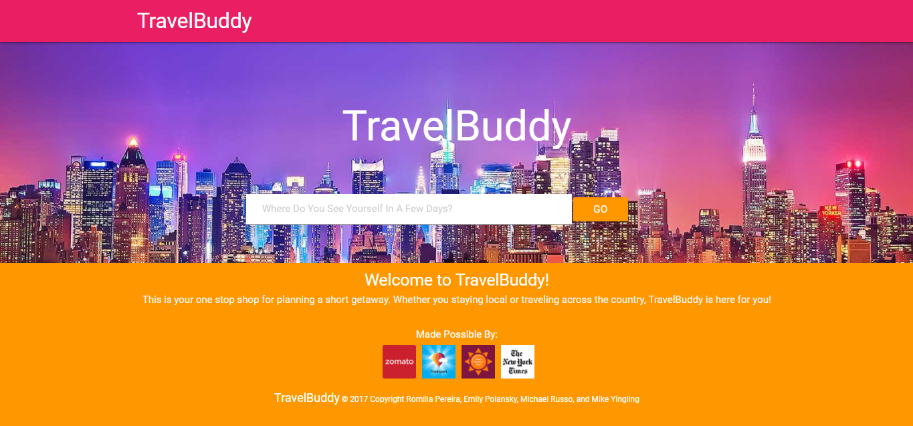
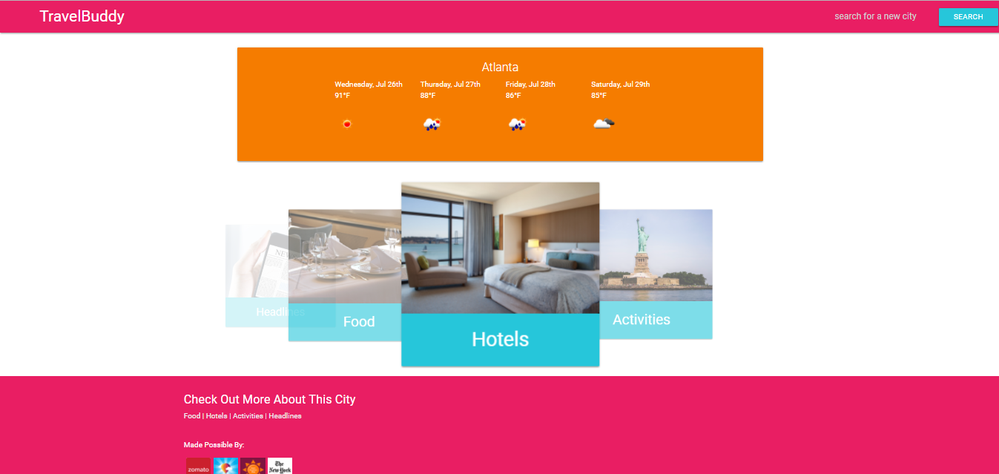

# TravelBuddy

TravelBuddy is a javascript/jquery application that uses the Zomato, Trip Expert, Open Weather Map, and New York Times API to provide the user with information about a city of their choosing. This app keeps all of your travel needs in one place!

## Functionality

When the user visits the app they are first brough to the main page.

Here the user can enter in a city they would like to find out more information about.

Once they user hits submit, they are brought to this dashboard page.

Here the user can choose to find out more infomration about places to eat, things to do, places to stay, and news for the area, along with the forcasted weather.

Once the user clicks on one of these, they are brought to a new page that lists the top 10 places, activities, or headlines from the corresponding APIs.

## Languages Used

This application used HTML, CSS, Materialize, Javascript, and JQuery.